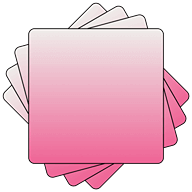

 

  

<h3 align="center">Gradie</h3>

  

    Turn any image into a vibe.
     
    <a href="https://github.com/Jemeni11/Gradie"><strong>Explore the repo »</strong></a>
     
  

Table of Contents

- [Introduction](#introduction)
- [Features](#features)
- [How It Works](#how-it-works)
- [Modes](#modes)
- [Why did I build this?](#why-did-i-build-this)
- [Contributing](#contributing)
- [Wait a minute, who are you?](#wait-a-minute-who-are-you)
- [License](#license)
- [Changelog](#changelog)

## Introduction

Gradie is a design tool that extracts the most prominent colors from an image and turns them into a smooth, beautiful gradient.

(<a href="#readme-top">back to top</a>)

## Features

These features can change at any time. Their existence depends on me having enough time or motivation to implement them all tbh.

- 🎨 Extracts dominant colors from an image
- 🌈 Creates a smooth gradient using the extracted palette
- 🔧 Offers multiple gradient strategies, detailed [below](#modes)
- 📁 Works with uploaded files or pasted images
- 📋 Copy CSS or image of the gradient
- ⚙️ Export options

(<a href="#readme-top">back to top</a>)

## How It Works

1. You upload or paste an image.
2. Gradie extracts a palette of the most prominent colors.
3. The first color in the palette is considered the dominant color.
4. You choose a gradient mode (see [Modes](#modes) for all options).
5. Gradie generates a smooth linear gradient using your selection.
6. You export it as CSS or download the image.

(<a href="#readme-top">back to top</a>)

## Modes

Gradie supports several modes for generating gradients from your image. Each one starts with the most prominent color (palette[0]) and builds from there.

| Mode Name        | Description                                                                                                            |
| ---------------- | ---------------------------------------------------------------------------------------------------------------------- |
| **Default**      | Most prominent color + second-most prominent.                                                                          |
| **Surprise Me!** | Most prominent color + a random pick from the rest of the palette.                                                     |
| **Bold Pop**     | Most prominent color + the most visually contrasting color in the palette. Great for high-impact, energetic gradients. |
| **Soft Sweep**   | Most prominent color + the palette color with the most different hue. Creates a warm-to-cool or cool-to-warm effect.   |
| **Full Blend**   | Uses all five palette colors to create a smooth multi-stop gradient.                                                   |
| **Custom**       | You choose any two colors from the extracted palette to create your own combo.                                         |

(<a href="#readme-top">back to top</a>)

## Why did I build this?

I saw a nice-looking image, thought the colours in it would look nice as a gradient background, and here we are!

(The image is the cover art for [mike's](https://genius.com/artists/Mike-mike-stud) [the lows.](https://genius.com/albums/Mike-mike-stud/The-lows) album, if you're wondering 🫡)

(<a href="#readme-top">back to top</a>)

## Contributing

Contributions are welcome! If you'd like to improve Gradie, please feel free to submit a pull request.

(<a href="#readme-top">back to top</a>)

## Wait a minute, who are you?

Hello there! I'm Emmanuel Jemeni, and I am a Frontend Developer.

You can find me on various platforms:

- [LinkedIn](https://www.linkedin.com/in/emmanuel-jemeni)
- [GitHub](https://github.com/Jemeni11)
- [Twitter/X](https://twitter.com/Jemeni11_)
- [Bluesky](https://bsky.app/profile/jemeni11.bsky.social)

If you'd like, you can support me on [GitHub Sponsors](https://github.com/sponsors/Jemeni11/)
or [Buy Me A Coffee](https://www.buymeacoffee.com/jemeni11).

(<a href="#readme-top">back to top</a>)

## License

[MIT License](LICENSE)

(<a href="#readme-top">back to top</a>)

## Changelog

[Changelog](/CHANGELOG.md)

(<a href="#readme-top">back to top</a>)

